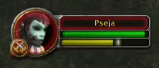

# RogueTick

Lightweight Vanilla World of Warcraft/Turtle WoW addon for Rogues that provides a visual indicator for the energy regeneration tick.

## Features

- No setup or frames, just a single always visible tick indicator
- Doesn't work for other classes than Rogues for now
- The timer starts when you log in and self-corrects using in-game events to stay synchronized

## Visuals

## Setup
### Vanilla (1.12.1)
1. Download this repository as `.zip` (Code > Download ZIP)
2. Copy the folder inside the `.zip` into your `AddOns` folder
3. Rename the folder to `RogueTick`

### Turtle WoW
1. Go to the `ADDONS` tab in the launcher
2. Click `Add new addon`
3. Copy `https://github.com/pseja/RogueTick` and paste it in
4. Click Install
